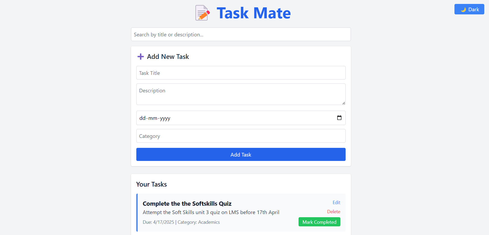

# 📝 Task Mate

**Task Mate** is a powerful and visually appealing full-stack To-Do List web application built with the **MERN Stack** (MongoDB, Express, React, Node.js) and styled with **TailwindCSS**. It lets users seamlessly create, update, delete, mark tasks as complete/incomplete, search, and even toggle between **light and dark mode**. ⚡

---

## 🚀 Live Demo

🌐 _[[http://localhost:3000/](http://localhost:3000/)]_  

---

## 📸 Screenshots

| Light Mode | Dark Mode |
|------------|-----------|
|  |  |

---

## 🔥 Features

✅ Create new tasks with title, description, due date, and category  
✅ Edit existing tasks  
✅ Delete tasks  
✅ Mark tasks as **completed** or **incomplete**  
✅ Toggle between **Light Mode 🌞** and **Dark Mode 🌙**  
✅ **Search tasks** by title    
✅ Fully **responsive design**  
✅ Modern **TailwindCSS** styling  
✅ Seamless integration with **MongoDB Atlas/local MongoDB**

---

## 🛠️ Tech Stack

**Frontend:**
- ReactJS
- TailwindCSS

**Backend:**
- Node.js
- Express.js
- MongoDB (Mongoose)

---
## ⚙️ Installation & Setup

### 1. Clone the Repository
git clone https://github.com/parbezalam590/TaskMate
cd TaskMate

