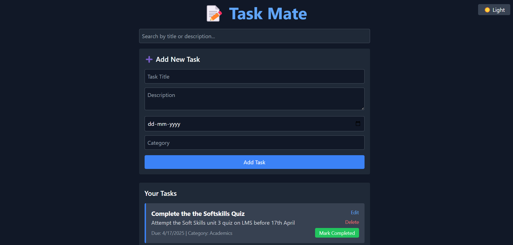

# 📝 Task Mate

**Task Mate** is a powerful and visually appealing full-stack To-Do List web application built with the **MERN Stack** (MongoDB, Express, React, Node.js) and styled with **TailwindCSS**. It lets users seamlessly create, update, delete, mark tasks as complete/incomplete, search, and even toggle between **light and dark mode**. ⚡

---

## 🚀 Live Demo

🌐 _[[Add link here if hosted](http://localhost:3000/)]_  

---

## 📸 Screenshots

| Light Mode | Dark Mode |
|------------|-----------|
|  |  |

---

## 🔥 Features

✅ Create new tasks with title, description, due date, and category  
✅ Edit existing tasks  
✅ Delete tasks  
✅ Mark tasks as **completed** or **incomplete**  
✅ Toggle between **Light Mode 🌞** and **Dark Mode 🌙**  
✅ **Search tasks** by title    
✅ Fully **responsive design**  
✅ Modern **TailwindCSS** styling  
✅ Seamless integration with **MongoDB Atlas/local MongoDB**

---

## 🛠️ Tech Stack

**Frontend:**
- ReactJS
- TailwindCSS

**Backend:**
- Node.js
- Express.js
- MongoDB (Mongoose)

---
## ⚙️ Installation & Setup
This guide will help you set up the **Task Mate** app's backend and frontend on your local machine.

### 1. Clone the Repository
git clone https://github.com/parbezalam590/task-mate.git
cd task-mate

### 2.🛠️ Backend Setup

1. Open the first terminal and navigate to the **backend** directory:
    cd backend
2. Start the backend server:
    node server.js
   - Make sure **MongoDB** is running locally or, if you're using **MongoDB Atlas**, replace the MongoDB URI in `server.js` with your **Atlas URI**.

### 3.💻 Frontend Setup

1. Open the second terminal and navigate to the **frontend** directory:
    cd frontend

2. Start the frontend development server:
    npm run dev
    - This will run the frontend on [http://localhost:3000](http://localhost:3000).
